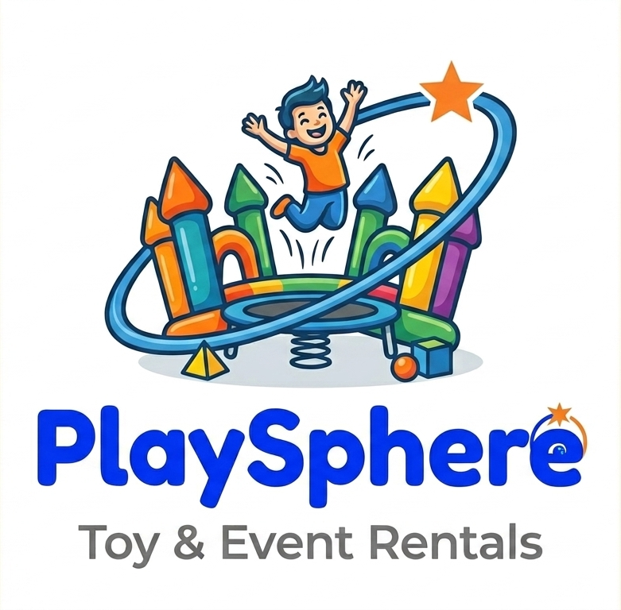

# PlaySphere Website - Modern Design Implementation Guide

## 🎨 Modern Design Overview

Your PlaySphere logo features beautiful colors:
- **Primary Blue**: #0052CC
- **Secondary Orange**: #FF6B35
- **Vibrant & Playful**: Perfect for a toy rental brand

## 📋 What's Included

### 1. **Modern CSS (modern_style.css)**
Complete redesign with:
- ✅ Logo colors integrated throughout (Blue #0052CC, Orange #FF6B35)
- ✅ Modern gradients matching your brand
- ✅ Smooth animations and transitions
- ✅ Better hover effects and interactions
- ✅ Improved card designs with subtle borders
- ✅ Modern footer with gradient social icons
- ✅ Mobile-responsive design

### 2. **Key Color Scheme**

```css
--primary: #0052CC;              /* Logo Blue */
--secondary: #FF6B35;            /* Logo Orange */
--primary-gradient: linear-gradient(135deg, #0052CC 0%, #0066FF 100%);
--secondary-gradient: linear-gradient(135deg, #FF6B35 0%, #FF8C5A 100%);
--blend-gradient: linear-gradient(135deg, #0052CC 0%, #FF6B35 100%);
```

## 🎯 Design Improvements

### Header & Navigation
- Clean, modern nav with blur effect
- Logo sits naturally with minimal text
- Gradient underline on hover
- Better spacing and alignment

### Hero Section
- Modern gradient background
- Floating animation elements
- Better typography hierarchy
- Improved CTA button contrast

### Package Cards
- Subtle border instead of heavy shadow
- Image zoom on hover
- Orange gradient text for prices
- Blue primary color for "View Details"

### How It Works Section
- Cards with white background and borders
- Numbered step icons with gradient
- Hover animation that lifts cards
- Better text hierarchy

### Hygiene Section
- Emoji icons for visual appeal
- Orange gradient text for headings
- White cards on light gradient background
- Modern border styling

### Footer
- Dark background with good contrast
- Orange hover effects on links
- Circular social icons with backgrounds
- Better organized layout

## 🚀 Implementation Steps

### Step 1: Replace CSS File
```bash
# Replace your current css/style.css with modern_style.css
cp modern_style.css css/style.css
```

### Step 2: Update HTML Structure
The HTML structure remains mostly the same, but ensure:

```html
<!-- Header remains the same -->
<header>
    <nav class="container">
        <a href="#home" class="logo">
            
            <div class="logo-text">
                Play Sphere <span>Bangalore</span>
            </div>
        </a>
        <!-- Navigation links -->
    </nav>
</header>
```

### Step 3: Add Font Weight
Update your Google Fonts import to include weight 800:
```html
<link href="https://fonts.googleapis.com/css2?family=Outfit:wght@300;400;500;600;700;800&display=swap" rel="stylesheet">
```

## 🎨 Color Usage Guide

| Element | Color | Usage |
|---------|-------|-------|
| Headers & Logo Text | #0052CC (Blue) | Primary brand color |
| Buttons (Primary) | Blue Gradient | Call-to-action buttons |
| Prices & Highlights | #FF6B35(Orange) | Eye-catching elements |
| Buttons (Secondary) | Blue Border | Secondary actions |
| Text | #1A1A2E (Dark) | Body text |
| Background | #F5F7FA (Light) | Section backgrounds |

## ✨ Special Features

### 1. **Logo Enhancement**
- Drop shadow on hover
- Smooth scale transformation
- Maintains aspect ratio
- Works with both light and dark backgrounds

### 2. **Modern Shadows**
```css
--card-shadow: 0 10px 30px rgba(0, 82, 204, 0.08);
--card-shadow-hover: 0 20px 40px rgba(0, 82, 204, 0.12);
```
Subtle, modern shadows using brand colors instead of black

### 3. **Gradient Borders**
- Cards have 1px border in light gray
- On hover, border changes to primary blue
- Creates visual feedback without heavy styling

### 4. **Modern Typography**
- Weight 800 for headers (bold, modern)
- Better letter spacing (-0.02em, -0.01em)
- Responsive font sizes using clamp()

### 5. **Interactive Elements**
- Smooth hover transitions (0.3s ease)
- Cubic bezier animations for buttons
- Floating background elements in hero
- Pulsing WhatsApp button

## 📱 Responsive Breakpoints

- **Desktop**: 1200px container
- **Tablet**: 768px - Full responsive layout
- **Mobile**: 480px - Single column, optimized touch targets

## 🔄 Migration Checklist

- [ ] Download modern_style.css
- [ ] Backup current style.css
- [ ] Replace style.css with modern version
- [ ] Update Google Fonts import to include weight 800
- [ ] Test on desktop browser
- [ ] Test on mobile devices
- [ ] Check all hover effects
- [ ] Verify logo displays correctly
- [ ] Test WhatsApp button functionality
- [ ] Check footer on mobile

## 🎯 Modern Design Principles Applied

1. **Minimalism**: Removed unnecessary gradients, kept clean lines
2. **Hierarchy**: Clear visual hierarchy with better spacing
3. **Brand Consistency**: Colors match your PlaySphere logo throughout
4. **Accessibility**: Good contrast ratios, readable fonts
5. **Performance**: Subtle animations that don't impact load time
6. **Mobile-First**: Responsive design that works on all devices
7. **Interactivity**: Smooth transitions and hover effects
8. **Modern Aesthetics**: Glassmorphism header, gradient accents

## 🎨 Example: Button Styling

### Before
```css
.btn-primary {
    background: var(--primary-gradient);
    color: var(--white);
}

.btn-primary:hover {
    transform: translateY(-4px) scale(1.03);
}
```

### After (Modern)
```css
.btn-primary {
    background: var(--primary-gradient);
    color: var(--white);
    box-shadow: var(--btn-shadow);
    transition: all 0.3s cubic-bezier(0.23, 1, 0.32, 1);
}

.btn-primary:hover {
    transform: translateY(-4px);
    box-shadow: var(--btn-shadow-hover);
}
```

## 💡 Pro Tips

1. **Logo Integration**: The logo now has a subtle drop shadow that enhances it without looking "boxy"
2. **Color Harmony**: Blues and oranges complement each other naturally
3. **Gradient Text**: Used sparingly for prices and special headings
4. **Whitespace**: More breathing room between sections
5. **Border Styling**: 1px borders replace heavy shadows for modern look

## 📊 Color Palette

```
Primary (Blue):        #0052CC → #0066FF (Gradient)
Secondary (Orange):    #FF6B35 → #FF8C5A (Gradient)
Dark Text:             #1A1A2E
Light Background:      #F5F7FA
Border Color:          #E5E7EB
Accent (Gray):         #6B7280
```

## 🎬 Animation Examples

### Float Animation (Hero Section)
```css
@keyframes float {
    0%, 100% { transform: translateY(0px); }
    50% { transform: translateY(30px); }
}
```

### Hover Effects
- Buttons: Lift up with enhanced shadow
- Cards: Lift up with border color change
- Icons: Rotate and scale on hover
- Links: Underline animation from left

## 📞 Questions?

If you need to customize any colors:
1. Find the color in :root variables
2. Update the hex value
3. The entire site automatically updates
4. No need to change multiple places

## 🚀 Next Steps

1. Implement modern_style.css
2. Test thoroughly on all devices
3. Gather feedback from users
4. Consider adding animations to more elements
5. Plan future enhancements

---

**Modern Design = Modern Success! 🎉**

Your PlaySphere logo is now seamlessly integrated throughout the website with a clean, professional, and contemporary design.
